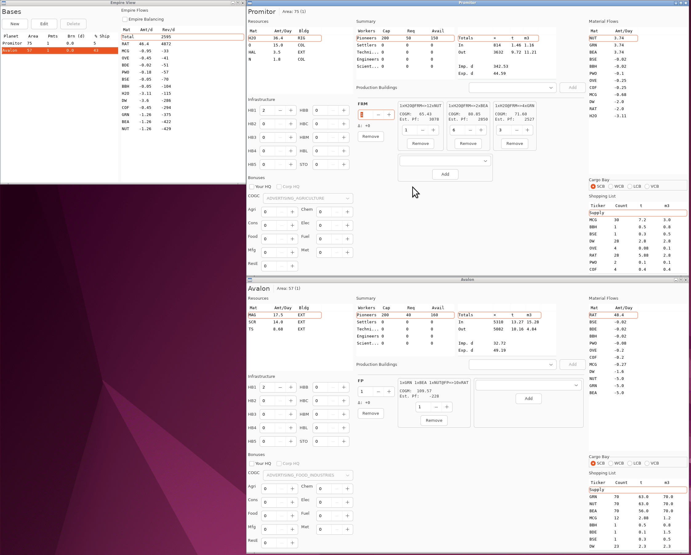

# Bob's Discount™ Planner

A locally run planner for when webpage-based planners are too slow.
Uses data from FIO, including your data with an API key.

## Dependencies
* Python 3.10+
* wxWidgets
* `pip3 install -r requirements.txt`
* Edit `pywxprun.cfg` to add a FIO API key and username (optional but
  highly recommended)

## Run
`python3 run.py`

## Features
* Multi-window workflows supported
* Instant updates across all windows
* Planet search (resources, COGC, distance from)
* Planet and empire-wide flows (including balancing view)

### With FIO API key
* Automatic import from FIO (first run)
* Highlight building deltas from FIO
* Construction and supply shopping lists
* Burn and %ship indicators

## Why
Computers are fast, but network calls and browser engines are slow

## Current limitations
* COGC currently forced to FIO value
* FIO import doesn't load HQs or experts
* FIO import recipe qtys might be wrong
* Resource extraction recipes might be wrong lol idk
* Does not account for free-permit ratio
* Stuff I'm not remembering lol

## License
This software is in the public domain (see `LICENSE`).